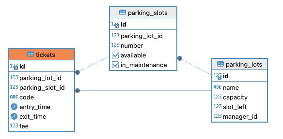

# Parking Lot Management System

A parking lot management system developed in [Go](https://golang.org/) for managing parking lots, parking slots, and tickets.

## Introduction

The Parking Lot Management System is designed to provide functionality for parking lot managers and users to manage parking spaces efficiently. It allows managers to create parking lots with desired parking spaces, put slots into maintenance mode, view parking lot status, and get summary on total parking tickets, parking time, and total fees collected. Users can park their vehicles in available slots and unpark them when necessary.

## Features

- Create parking lots with desired parking spaces
- Park vehicles in the nearest available slot
- Unpark vehicles and calculate parking fees
- View parking lot status
- Put slots into maintenance mode
- Get parking summary on total parking tickets issued, parking time, and total fees collected

## Requirements

- Go 1.21+
- Docker and docker-compose

## Installation

1. Clone the repository:

   ```bash
   git clone https://github.com/ahsanulks/parking-management.git
   ```
2. Navigate to the project directory:
   ```bash
   cd ahsanulks/parking-management
   ```
3. Run
   ```bash
   docker-compose up
   ```

## API Endpoints

All endpoints provided in swagger format that can accessed on http://localhost:8080/swagger/index.html


## Project Description
1. Utilizes parking tickets instead of vehicle registration for user interaction. This approach allows for ticket issuance to guest users who may not want to register or log in beforehand, streamlining the parking process.
2. Simplifies the system by focusing on parking management, with the parking manager's user ID hard-coded as 1 for ease of demonstration and initial setup.
3. Testing functionalities are not included in this iteration due to time constraints. However, you can refer to my previous projects to gain insights into how testing is implemented. e.g [this project](https://github.com/ahsanulks/user-service)

### ERD

